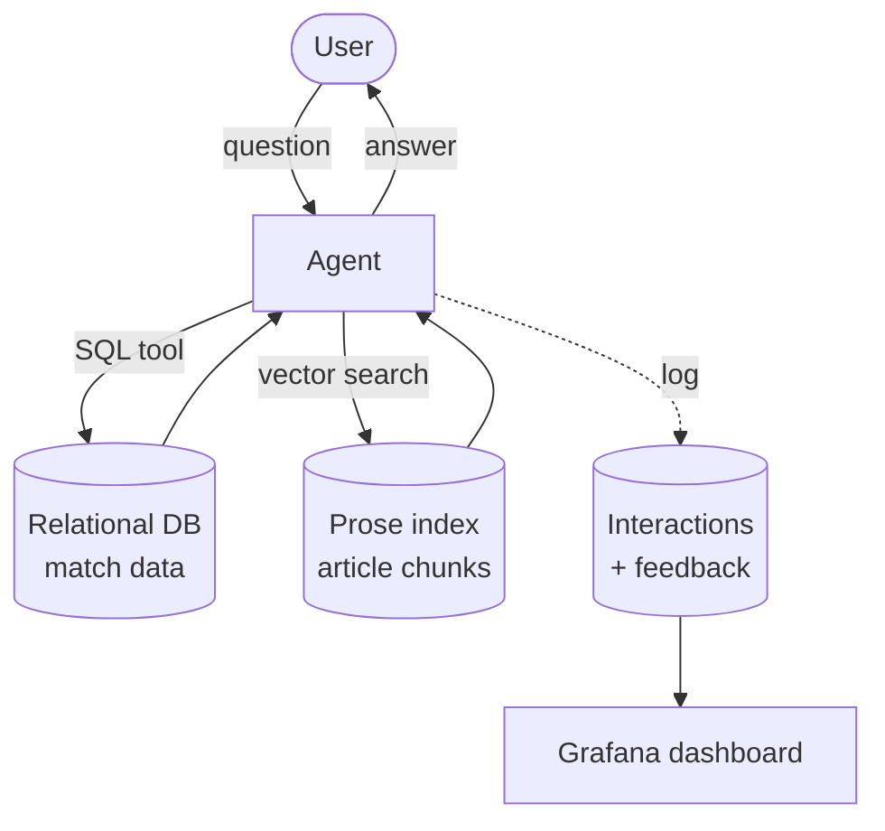

# World Cup 2026 — LLM Knowledge Base

A question-answering system over everything that happened at the 2022 FIFA World Cup — from hard facts (*who advanced to the quarter-finals?*) to open-ended, narrative questions (*what was the biggest scandal involving Switzerland?*).

It combines a **relational database** (structured match data), a **vector index** (tournament prose), and an **agent** that routes each question to the right source — or both.

---

## How it works

The user asks a question in a chat UI. An agent decides which of two surfaces to query:

- **Relational DB** — structured facts, via SQL tool calls (results, standings, lineups, venues…)
- **Prose index** — narrative/semantic questions, via vector search over encoded Wikipedia articles



---

## Data sources

### Structured — API-Football

Ingested **once** from API-Football (World Cup = `league id 1`). Entities pulled:

- leagues, standings, teams, venues, coaches, players
- fixtures / matches, lineups
- in-match events (goals, cards, substitutions — with the minute they happened)

Lineups are the key table: they power relational questions like *"did players X and Y play against each other?"* — a self-join on appearances in the same match on opposite teams.

**Ingestion:** dlt (REST-API source → Postgres destination), re-runnable.

*Data-source reference: [API-Football data model](https://www.api-football.com/public/img/news/archi-beta.jpg)*

### Unstructured — Wikipedia

A small, curated **manifest** of *tournament-level* articles (Qatar 2022, matching the structured data):

- `2022 FIFA World Cup` — the main article, and the workhorse of the corpus
- `2022 FIFA World Cup final`
- `2022 FIFA World Cup knockout stage`
- `2022 FIFA World Cup opening ceremony`
- `List of 2022 FIFA World Cup controversies`

Each article is pinned to a specific **revision id** (`ingestion/prose/manifest.py`) so the corpus is reproducible and doesn't drift as Wikipedia keeps updating.

Table-shaped sections (group standings, squads, base camps) are **not** ingested as prose — that data comes from the structured side. The rule: *sentences → prose index; cells → SQL.*

---

## Ingestion flows

### Prose (Wikipedia → vector index)

```
read pinned-revision manifest
  → fetch each article        (MediaWiki Action API, by oldid)
  → split into sections       (mwparserfromhell — strip markup, get sections)
  → tag chunk {source_article, section, teams_mentioned}
  → embed
  → write to vector index
```

### Structured (API-Football → SQL)

```
dlt REST-API pipeline → Postgres
  (leagues, teams, venues, coaches, players, fixtures, lineups, standings)
```

---

## Storage

- **Relational:** Postgres (dockerized)
- **Prose / vector index:** Postgres + `pgvector` extension for embeddings (`pgvector/pgvector:pg16` image)

---

## Interface

A simple **Streamlit** chat app (`uv run streamlit run app/main.py`). Each answer
carries a 👍 / 👎 feedback control, and every interaction is logged to Postgres
for the monitoring dashboard.

---

## Monitoring

Online evaluation on live traffic:

- Every interaction logged — question, answer, model, tokens, cost, latency, tools used, feedback
- **LLM-as-judge** scores answer relevance on real traffic
- **Grafana dashboard** (≥ 5 charts): feedback rate, response time, cost/tokens, judge relevance, tool-routing breakdown, feedback split by tool path

Built — see [Monitoring (judge + Grafana)](#monitoring-judge--grafana) below.

---

## Evaluation

> **TODO** — offline evaluation (distinct from monitoring above):
> - **Retrieval:** compare lexical vs. vector vs. hybrid (Hit Rate, MRR); best one is used
> - **Answer quality:** LLM-as-judge across multiple prompt variants — reusing
>   `monitoring/llm.py` and the verdict model from `monitoring/judge.py`

---

## Setup

`docker compose up -d` runs Postgres (with `pgvector`) and Grafana. The
Streamlit app and the ingestion pipelines run on the host via `uv run`, because
they need the ONNX embedding model in `models/`, which is not committed —
`uv run python scripts/download_model.py` fetches it once.

Required in `.env`: `FOOTBALL_API_KEY`, `OPENAI_API_KEY`, `POSTGRES_USER`,
`POSTGRES_PASSWORD`, `POSTGRES_DB`. Optional: `POSTGRES_HOST`, `POSTGRES_PORT`,
`MAX_REQUESTS_PER_RUN`, `OPENAI_MODEL`, `OPENAI_JUDGE_MODEL`.

> **TODO** — pinned dependency versions.

---

## Ingestion (API-Football → Postgres)

One dlt pipeline loads teams, standings, fixtures, lineups, and match events for the
FIFA World Cup (league 1). The season is pinned to 2022 (Qatar) because API-Football's
free plan only exposes seasons 2022–2024 — season 2026 requires a paid plan; flip `SEASON` in
`ingestion/football/__init__.py` if that changes. Lineups and events each cost 1 API call
per fixture, so the pipeline is budgeted (`MAX_REQUESTS_PER_RUN`, default 90) and
resumable — re-run it daily until complete; finished runs are no-ops on the expensive
endpoints. Events carry the minute (`time__elapsed`) for goals, cards, and
substitutions; in `subst` rows, `player` is the one coming off and `assist` the one
coming on.

```bash
docker compose up -d                              # start Postgres
uv run python -m ingestion.football.pipeline      # run the pipeline (re-runnable)
uv run pytest                                     # tests (never hit the live API)
uv run python scripts/smoke_test.py               # MANUAL: 1 real API call to /status
```

Required in `.env`: `FOOTBALL_API_KEY`, `POSTGRES_USER`, `POSTGRES_PASSWORD`,
`POSTGRES_DB` (optional: `POSTGRES_HOST`, `POSTGRES_PORT`, `MAX_REQUESTS_PER_RUN`).

## Ingestion (Wikipedia → pgvector)

The prose pipeline fetches the 5 pinned articles, splits them into per-section
chunks (≤256 tokens, tables and boilerplate dropped), tags each chunk with the
teams it mentions, embeds with `all-MiniLM-L6-v2` (ONNX, 384-dim), and writes to
`prose.chunks` in the same Postgres. Full refresh on every run — no API keys or
quotas involved. Embedding code follows the llm-zoomcamp course (ONNX Runtime
instead of PyTorch).

```bash
uv run python scripts/download_model.py           # one-time: fetch the ONNX model
uv run python -m ingestion.prose.pipeline         # fetch + chunk + embed + load
uv run python -m ingestion.prose.search "Who scored in the final?"          # smoke search
uv run python -m ingestion.prose.search "biggest scandal?" Switzerland      # team-filtered
```

Requires the structured pipeline to have run first (`football.teams` powers the
team tagging).

## Agent (CLI chat)

A handwritten agentic loop (OpenAI Responses API function calling, following the
llm-zoomcamp agentic-RAG module) routes each question across three tools:

- `execute_sql` — raw read-only SQL against `football.*`; the schema (including
  the dlt child-table joins for lineups) is documented in the instructions, and
  query errors are fed back to the agent so it can fix its own SQL
- `search_prose` — pgvector cosine search over `prose.chunks`, optional team filter
- `read_section` — expands a search hit into its full article section

```bash
uv run python -m agent.cli                                        # interactive chat (multi-turn)
uv run python -m agent.cli "Did Messi and Mbappé play against each other?"   # one-shot
```

Each answer prints a footer with the tools used, token count, and latency —
the raw material for the monitoring milestone. Requires `OPENAI_API_KEY` in
`.env` (optional: `OPENAI_MODEL`, default `gpt-5.4-mini`) and both ingestion
pipelines to have run.

## Chat UI (Streamlit)

The Streamlit app wraps the same agent loop as the CLI in a chat transcript
with multi-turn history. Each answer shows the CLI-style footer (tools, tokens,
latency, plus cost), an LLM-as-judge relevance badge, and a 👍/👎 control. Every
interaction is logged to `monitoring.conversations` (question, answer, model,
tokens, latency, cost, tool calls as JSONB); each thumb click and each judge
verdict goes to `monitoring.feedback`. Logging follows the llm-zoomcamp
monitoring module; tables are created idempotently on first launch.

```bash
uv run streamlit run app/main.py                  # chat at http://localhost:8501
uv run python -m monitoring.db                    # optional: init tables standalone
```

Same requirements as the CLI agent.

## Monitoring (judge + Grafana)

### LLM-as-judge

Every answer is scored for relevance by a second LLM call, inline in the chat
turn, following the course's lesson-09 judge: answer → log the conversation →
judge → log the verdict as `source='judge'` feedback. Verdicts are
`RELEVANT` / `PARTLY_RELEVANT` / `NON_RELEVANT` with a written explanation,
obtained as structured output (`client.responses.parse`) so the label is always
one of the three.

The prompt is rewritten for this domain. Two rules matter for reading the
chart: a multi-part question needs *every* clause answered to count as
RELEVANT, and declining to answer is NON_RELEVANT even though declining is the
right behaviour when the tools found nothing — the score measures whether the
user got what they asked for, not whether the system behaved well.

Two deviations from the course. The judge records **its own cost** in
`feedback.cost`, because judging every answer roughly doubles the per-question
spend and a cost chart that ignores it is wrong by half. And the judge can
never break the chat: if there is no answer to score (the agent hit its
iteration cap) it is skipped without spending a call, and if the judge itself
fails after retries the answer still renders, just without a badge.

```bash
uv run python -m monitoring.judge                 # smoke test: one real call
```

### Tool paths

Three panels group conversations by which half of the knowledge base the agent
actually reached, derived from the logged `tool_calls`:

| path | meaning |
|---|---|
| `sql-only` | `execute_sql` only |
| `prose-only` | `search_prose` / `read_section` only |
| `mixed` | both — the questions in `docs/mixed-routing-questions.md` |
| `none` | answered or declined without calling a tool |

### Dashboard

Nine panels: feedback rate, response time (avg + p95), cost split agent vs
judge, tokens, judge relevance, tool routing, tool calls by tool, feedback by
tool path, and a recent-conversations table.

Grafana is **provisioned from committed files** (`grafana/provisioning/`) rather
than clicked together in the UI as the course does, so `docker compose up`
yields a working dashboard with nothing to configure. The datasource takes its
credentials from the environment, so no password is committed.

```bash
docker compose up -d                              # Postgres + Grafana
uv run python -m monitoring.seed --hours 6 --count 150   # fabricated back-dated traffic
uv run python -m monitoring.seed --purge          # remove it again
```

Grafana is at http://localhost:3000 (admin / admin — local only). The seed
script makes no LLM calls; it fabricates conversations and feedback spread over
the last few hours so a fresh dashboard opens on a full time axis. Seeded
questions are prefixed `[seed]` so they are obvious in the table panel and can
be purged cleanly.